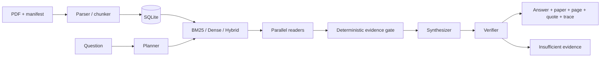

# Paper Agent

证据优先的论文研读与可复现评测系统。项目把 PDF 导入、可替换检索器、受控 Agent 编排、引用门控、SQLite 检查点、结构化 trace 和故障注入测试放在同一条本地工作流中。每条输出结论都绑定论文、页码、证据 ID 和原文引句；证据不足时返回拒答。

> 当前公开结果来自 50 篇论文和 60 个冻结诊断问题（50 个可回答、10 个不可回答），标签由助理编写且尚未独立人工复核。它们用于回归与消融，不是公开 Benchmark。

## 系统结构



- **检索层**：BM25、字段加权、可审计 Query Expansion、Dense LSA、RRF Hybrid；Sentence-Transformer 与 Cross-Encoder 作为可选 Provider。
- **Agent 层**：Planner、Paper Reader、Synthesizer、Verifier；限制并发、论文数、修复轮数和模型回退次数。
- **证据层**：页级引句校验、精确信息约束门控、证据不足拒答；结构校验不冒充语义蕴含。
- **工程层**：SQLite 内容寻址检查点、幂等导入、版本化 Pydantic schema、YAML 实验配置、FastAPI、Docker、GitHub Actions。
- **评测层**：Paper-level Hit/Recall/MRR/nDCG、引用结构指标、Agent 拒答与目标论文覆盖、故障注入恢复率。

## 已实测结果

| 实验 | 结果 | 适用边界 |
|---|---:|---|
| BM25 → Hybrid + Cross-Encoder | Hit@1 **90.0% → 96.0%**，Hit@3 **98.0% → 100%** | 50 个可回答冻结问题；0 个独立人工复核 |
| 轻量 Hybrid LSA | Hit@3 **100%**，平均检索 **3.92 ms** | 不含约 1.43 s 索引构建；同上 |
| Evidence Gate OFF → ON | 拒答 **0/8 → 8/8** | 8 个构造的缺失精确细节问题；可回答用例目标论文覆盖保持 7/8 |
| 引用结构校验 | **144/144** 引句可回溯原页 | 32 次 extractive 运行；只验证 provenance，不验证语义蕴含 |
| 故障注入 | **10/10** 场景恢复 | 本地确定性注入；不代表线上 SLA |
| 自动化测试 | **73 passed** | Windows / Python 3.12 本地运行；不代表生产负载测试 |

完整定义、逐项限制、负结果和复现命令见 [Benchmark report](docs/BENCHMARK.md)。Cross-Encoder 平均查询时延为 1186.75 ms；单独使用 MiniLM Dense 的 Hit@1 只有 70.0%。字段加权和词表式 Query Expansion 的 Hit@1 均为 86.0%，低于 BM25 的 90.0%，这些负结果同样保留。

LLM Verifier 消融和多 Agent 对照当前状态为 `REQUIRES API KEY`，不会用历史或估计数字补齐。语义答案正确率也未声称已测。

## 快速开始

需要 Python 3.11+。

```powershell
python -m venv .venv
.\.venv\Scripts\Activate.ps1
python -m pip install -r requirements.txt
python scripts/fetch_corpus.py
python -m paper_agent corpus --manifest data_manifest.json
python -m paper_agent search "multi-agent verification"
```

本地 Web UI：

```powershell
python -m paper_agent serve --port 8765
```

FastAPI：

```powershell
uvicorn paper_agent.api:app --host 127.0.0.1 --port 8000
```

Docker：

```powershell
docker compose up --build
```

LLM 模式使用 OpenAI-compatible HTTPS endpoint。复制 `.env.example` 的变量名，在本机设置密钥；不要提交 `.env`。`PAPER_AGENT_FALLBACK_MODELS` 最多启用两个顺序回退模型。

## 评测与测试

```powershell
python -m pytest -q
python scripts/validate_benchmark.py
python scripts/run_benchmark.py --profile full
```

每次检索实验保存配置、时间、Git commit、语料签名、Benchmark 哈希、逐题 CSV、汇总 JSON 和 Markdown 报告。冻结问题集由 `benchmark/manifest.json` 做 SHA-256 校验。数据状态和指标口径见 [Evaluation protocol](docs/EVALUATION.md)。

## 项目结构

```text
paper_agent/   存储、检索、Agent 编排、检查点、API 与评测模块
benchmark/     版本化问题与 Agent 用例；明确 verified 状态
configs/       retrieval / ablation / judge 实验配置
scripts/       语料、Benchmark、评测、故障注入和报告生成
results/       可复现实验输出
tests/         离线单元与集成测试
docs/          Benchmark、评测口径和部署说明
```

PDF、SQLite、密钥、模型缓存和运行 trace 默认不进入 Git。语料 manifest 保存 title、authors、year、arXiv/source URL、DOI（存在时）；[`corpus_provenance.json`](corpus_provenance.json) 保存 50 份下载 PDF 的 URL、字节数和 SHA-256，不提交原始 PDF。

## 当前限制

- 当前冻结集含 24 个保留种子问题、26 个基于 arXiv 摘要生成的问题和 10 个构造的不可回答问题，均未独立人工复核；结果只用于项目回归与消融。
- PDF 表格、公式和扫描件解析有限，扫描件需要额外 OCR。
- LLM-as-a-Judge 配置已预留，但在人工校准和保存原始输出之前不报告其准确率。
- FastAPI 路由已做本地集成测试；当前机器没有 Docker，镜像构建标记为 `NOT RUN`。两者都不代表生产负载测试或线上 SLA。

## License

[MIT](LICENSE)
