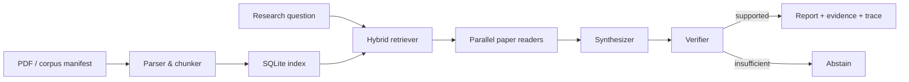

# Paper Agent

面向论文研读的证据优先多 Agent 系统。它把论文导入、混合检索、并行阅读、事实核验、失败恢复和可复现实验串成一条本地工作流，并为每条结论保留页码、原文引句和处理轨迹。

## 核心能力

- **混合检索**：BM25、字段加权、短语匹配与查询扩展，支持论文级去重和页级定位。
- **受控多 Agent 编排**：Planner、Paper Reader、Synthesizer、Verifier 分工；并发、超时、重试和降级均有上界。
- **证据门控**：回答必须绑定论文、页码与可复核引句；证据不足时明确拒答。
- **故障恢复**：SQLite 检查点、幂等步骤、过期任务恢复和单模型降级，避免重复调用与重复产物。
- **本地界面**：零前端依赖的 Web UI，可查看任务状态、对照表、引用与 trace。



## 实测结果

所有原始摘要均保存在 [`evaluation/`](evaluation/)；仓库不包含论文 PDF。

| 验证项 | 结果 | 边界 |
| --- | ---: | --- |
| 自动化测试 | 58 passed | Windows, Python 3.12 |
| 新问题检索集 | Hit@1 54.2% → 83.3%，Recall@3 100% | 12 篇既有语料、24 个助理标注问题，尚未独立人工复核 |
| 不可回答问题拒答 | 4/4 | 冻结证据、多 Agent v4 |
| 引句页内校验 | 全部通过 | 19 条返回结论；验证字符串存在性，不等同于语义蕴含 |

这组结果用于验证工程行为，不代表通用论文问答基准。单 Agent / 多 Agent 消融的请求数、时延和 token 用量见 [`ablation_summary.json`](evaluation/depth_results/ablation_summary.json)。

## 快速开始

需要 Python 3.11+。

```powershell
python -m venv .venv
.\.venv\Scripts\Activate.ps1
python -m pip install -r requirements.txt
python -m paper_agent --help
```

按清单下载公开语料并建立索引：

```powershell
python scripts/fetch_corpus.py
python -m paper_agent corpus --manifest data_manifest.json
python -m paper_agent search "multi-agent verification"
```

启动本地网页：

```powershell
python -m paper_agent serve --port 8765
```

使用 OpenAI 兼容接口时复制 `.env.example` 中的变量名，并在本机环境变量中填写密钥。不要把密钥提交到仓库。没有模型密钥时，检索、导入和离线测试仍可运行。

## 测试与评测

```powershell
python -m pytest -q
python scripts/evaluate.py
python scripts/depth_evaluate.py
```

测试覆盖检索、引用校验、并发编排、预算限制、超时重试、断点恢复和 HTTP 接口。`evaluation/heldout_v2.freeze.json` 固定问题与标签哈希，避免评测过程中静默改题。

## 数据与隐私

- `data/`、`runs/`、数据库、PDF 和运行 trace 默认忽略。
- 下载脚本只处理 [`data_manifest.json`](data_manifest.json) 中声明的公开论文，并核验 SHA-256。
- 日志会对常见密钥格式脱敏；公开仓库仍应在提交前执行秘密扫描。

## 项目结构

```text
paper_agent/   检索、存储、编排、检查点与 Web 服务
scripts/       语料下载、评测与消融实验
tests/         离线自动化测试
evaluation/    冻结问题集和紧凑实验摘要
```

## 致谢

项目选题与功能拆分参考了 [AgentGuide](https://github.com/adongwanai/AgentGuide) 中的 Paper Agent 项目建议；本仓库实现、测试与评测代码为独立完成。

## License

[MIT](LICENSE)
